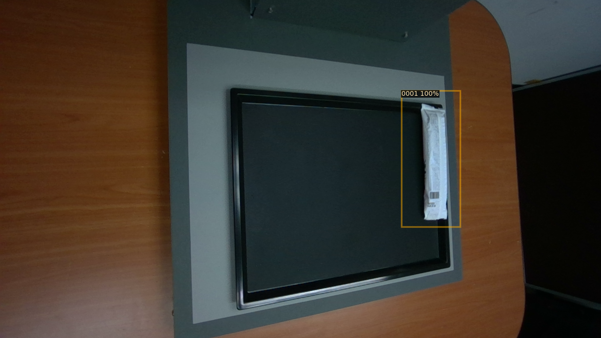

# 기산전자

- Get bounding box of a product in an image




## Getting Started

### Environment Setup

Tested on NVIDIA RTX 3090 with python 3.9, pytorch 1.12.1, torchvision 0.13.1, CUDA 11.7 / 11.8 and detectron2 v0.6

1. Install dependencies
       ```
       sudo apt update && sudo apt upgrade
       ```

2. Set up a python environment
   1. Install [PytTorch](https://pytorch.org/get-started/locally/)
   - example (below works for above tested environment)
       ```
       conda install pytorch torchvision torchaudio pytorch-cuda=11.7 -c pytorch -c nvidia
       ```
   2. Create and activate conda environment
       ```
       conda create -n kisan_electronics python=3.9
       conda activate kisan_electronics
       ```
   3. Install [Detectron2](https://detectron2.readthedocs.io/en/latest/tutorials/install.html#install-pre-built-detectron2-linux-only)
   - example of CUDA 11.3 / torch 1.10 (below works for above tested environment)
       ```
       python -m pip install detectron2 -f https://dl.fbaipublicfiles.com/detectron2/wheels/cu113/torch1.10/index.html
       ```
    4. Install other dependencies
       ```
       pip install opencv-python
       ```


## Train & Evaluation

### Dataset Preparation
1. Prepare kisan dataset 
    ```
    /원하는 dataset 저장장소/kisane_DB/
    ```

2. Change `cfg.OUTPUT_DIR` in `train.py` to your desired output directory


3. Change `dataset_dir` in `main` method in `train.py` to your dataset directory. Just under `dataset_dir` only contains category directories.
    ```
    kisane_DB
        └── V0_0_1
               └── LI3
                    └──0001
                    └──0002
                    └──0003
                    ...   
    ```
### Train on sample dataset
- Before train, you should change `args.num_gpus` in `train.py` to your GPU number. Or simply add `--num-gpus 1` in `train.py` command.
    ```
    python train_net.py
    ```
    or
    ```
    python train_net.py --num-gpus 1
    ```

### Check inference result
1. Check result image
- Before start, change `image_dir` in `save_inference_image.py` to your single image directory.
    ```
    python save_inference_image.py
    ```
2. Check result metric
- Before start, change `metric_path` and `best_metric` in `check_metric.py` to your metric path and best metric.
    - In detectron2, metric path save in `cfg.OUTPUT_DIR` at `train.py`.
    - `best_metric` is a json file that will create after the code execution.
    ```
    python check_metric.py
    ```

## Authors
- **Seongho bak**